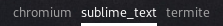

# Script: polybar-windows-c

A [Polybar](https://github.com/jaagr/polybar) taskbar on C that shows active window and other opened and minimized windows as (non-clickable) labels.

How it looks right now:



## Dependencies

* `gcc`

## Configuration

Compile program with gcc (add XLib headers with -lX11)

```bash
$ gcc polybar-windows-c.c -lX11 -o polybar-windows-c
```

## Module

```ini
[module/polybar-windows-c]
type = custom/script
exec = polybar-windows-c
format = <label>
tail = true
label = %output%
label-padding = 1
```
